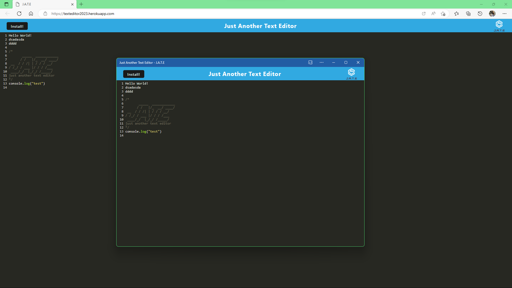

# Text-Editor(J.A.T.E)

  

  ## Description
  J.A.T.E Text-Editor is a progressive web applications
  ## Sample_Img
  
  ## Deployed Application link
  https://texteditor2023.herokuapp.com/

  ## Table of Contents
  * [Installation](#installation)
  * [Usage](#usage)
  * [License](#license)
  * [Contributing](#contributing)
  * [Tests](#tests)
  * [Questions](#questions)

  ## Installation 
  * Clone or download this repository. 
  * Use command 'npm i' to install all the require file

  ## Usage 
  Use the command 'npm start" to start the app. 
  Then open web browser at localhost:3000 
  or use the deployed link:https://texteditor2023.herokuapp.com/ 

  ## License 
  [GPLv3](https://choosealicense.com/licenses/gpl-3.0/)

  ## Contributing 
  N/A

  ## Tests
  N/A

  ## Questions
  Let me know if you need any help from me, you can contact me at jaspercheng2022@gmail.com. For more detail, please visit https://github.com/hpyorange or https://hpyorange.github.io/JasperWeb/.
